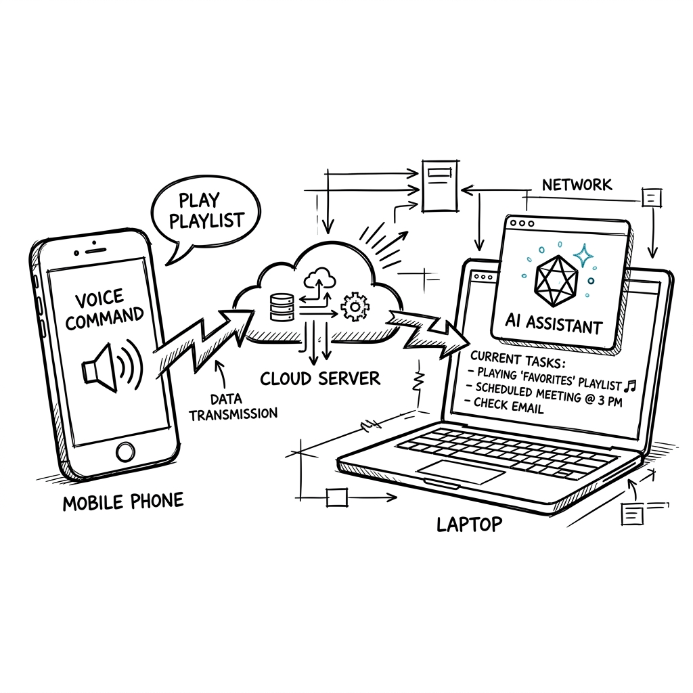
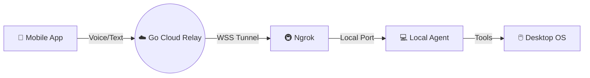
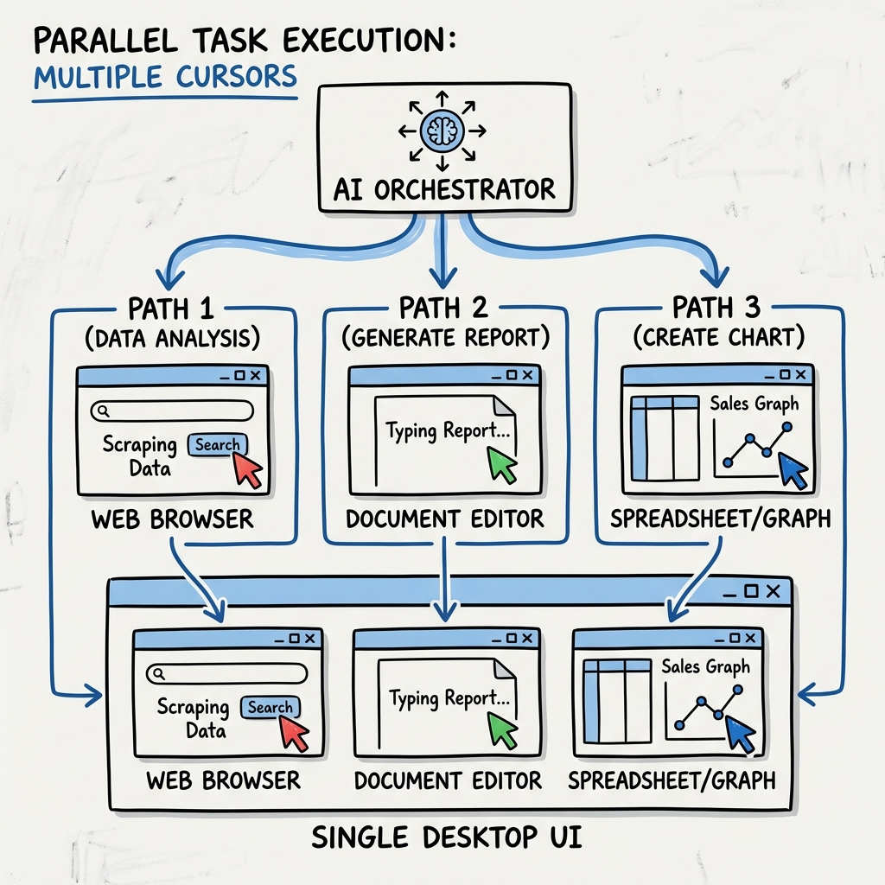
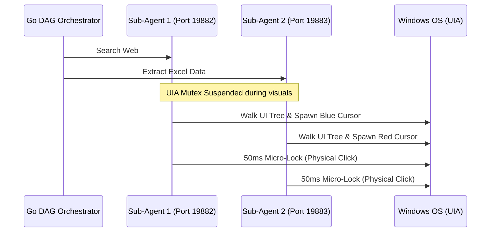
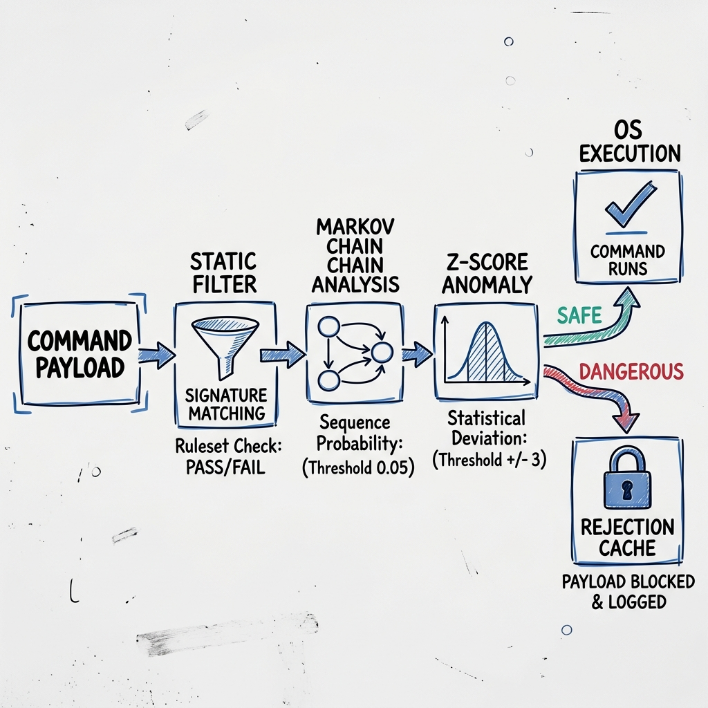
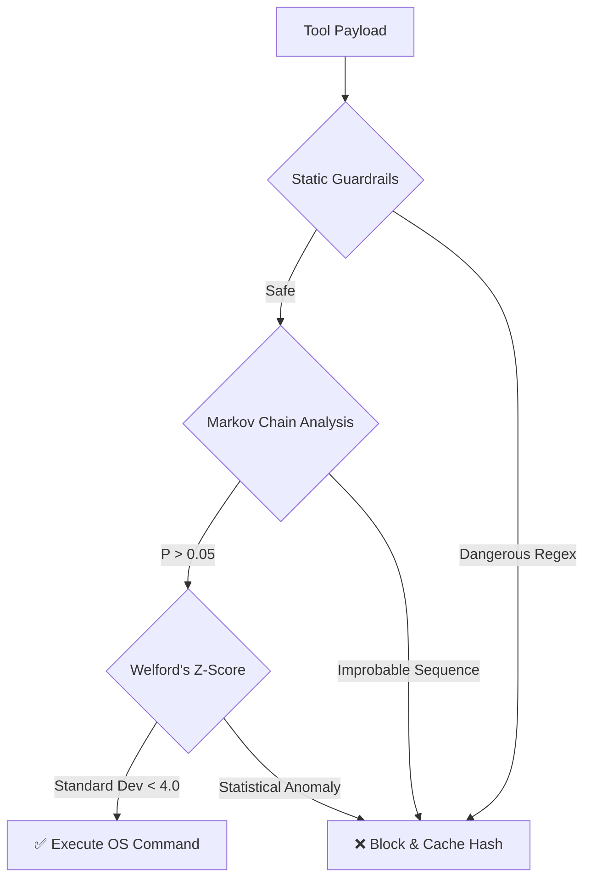

<div align="center">
  <h1>✨ Voila: Your Floating AI CLI Assistant</h1>
  <p><i>A Zero-Trust, Voice-Controlled Remote Execution System with Multi-Agent Swarm & ML Security.</i></p>
</div>

---

<div align="center">
  
</div>

## 🚀 What is Voila?
**Voila** is an interactive, animated AI agent that floats elegantly on your desktop. She listens to your voice commands via a mobile app, instantly translates them into code, and executes them securely on your local machine using an end-to-end encrypted zero-trust pipeline.

### High-Level Network Topology


---

## 🐝 Graphify: Multi-Agent Swarm Architecture
Graphify mode allows Voila to split complex commands into a Directed Acyclic Graph (DAG) and spawn multiple independent AI agents to accomplish them simultaneously.

<div align="center">
  
</div>

### Hybrid Concurrency Execution Model
To allow multiple agents to use a single mouse without colliding, Voila utilizes a **Micro-Locking Hybrid Architecture**:


---

## 🛡️ Aegis: ML Security & Monitoring Firewall
Giving AI agents raw access to your terminal and mouse is dangerous. **Aegis** is our independent, machine-learning-based security module that monitors every single action locally without relying on external LLM APIs.

<div align="center">
  
</div>

### The Aegis Verification Pipeline

- **Static Guardrails**: Blocks malicious paths (`System32`) and sensitive windows (`Password`, `Bank`).
- **Dynamic Markov Chains**: Prevents AI hallucinations by recognizing and stopping infinite loops.
- **Welford's Z-Score**: Isolates execution time and payload sizes per tool to detect statistically anomalous speeds or bulk operations.

---

## ⚡ Quick Start Guide

### 1. Configure `.env` (Project Root)
```env
NGROK_AUTHTOKEN=your_ngrok_authtoken_here
AGENT_REGISTER_SECRET=your_registration_secret_here
CLEAR_DATA_SECRET=your_clear_data_secret_here
```

### 2. Start the Agents
Start the **Cloud Relay** (can be hosted on Render.com):
```bash
NGROK_AUTO_DETECT=true go run main.go
```
Start the **Local Agent** (Your Desktop):
```bash
cd local-agent
start_agent.bat
```

### 3. Connect the Mobile App
```bash
cd mobile-agent
flutter build apk --dart-define=BACKEND_URL=wss://your-backend.onrender.com/ws
```

## 🤝 License & Contributing
MIT License. We are actively looking for contributors specialized in **Agentic AI** and **Pentesting**. Open a PR to help build the ultimate local AI assistant!
